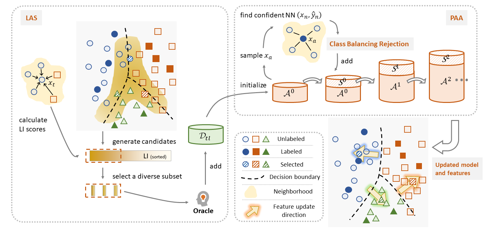

# Local Context-Aware Active Domain Adaptation               


## Abstract
Active Domain Adaptation (ADA) queries the labels of a small number of selected target samples to help adapting a model from a source domain to a target domain. The local context of queried data is important, especially when the domain gap is large. However, this has not been fully explored by existing ADA works. 

In this paper, we propose a Local context-aware ADA framework, named LADA, to address this issue. To select informative target samples, we devise a novel criterion based on the local inconsistency of model predictions. Since the labeling budget is usually small, fine-tuning model on only queried data can be inefficient. We progressively augment labeled target data with the confident neighbors in a class-balanced manner. 

Experiments validate that the proposed criterion chooses more informative target samples than existing active selection strategies. Furthermore, our full method surpasses recent ADA arts on various benchmarks. 
<p align="center">
     <br>
</p>


## Usage
### Prerequisites
We experimented with python==3.8, pytorch==1.8.0, cudatoolkit==11.1. 

To start, download the [office31](https://faculty.cc.gatech.edu/~judy/domainadapt/), [Office-Home](https://www.hemanthdv.org/officeHomeDataset.html), [VisDA](https://ai.bu.edu/visda-2017/) datasets and set up the path in ./data folder.

### Training
To obtain results of baseline active selection criteria on office home with 5% labeling budget,
```shell
for ADA_DA in 'ft' 'mme'; do
  for ADA_AL in 'random' 'entropy' 'margin' 'coreset' 'leastConfidence' 'BADGE' 'AADA' 'CLUE'; do
    python main.py --cfg configs/officehome.yaml --gpu 0 --log log/oh/baseline  ADA.AL $ADA_AL  ADA.DA $ADA_DA
  done
done
```

To reproduce results of LADA on office home with 5% labeling budget,
```shell
# LAS + fine-tuning with CE loss
python main.py --cfg configs/officehome.yaml --gpu 0 --log log/oh/LADA  ADA.AL LAS  ADA.DA ft
# LAS + MME model adaptation
python main.py --cfg configs/officehome.yaml --gpu 0 --log log/oh/LADA  ADA.AL LAS  ADA.DA mme
# LAS + Random Anchor set Augmentation (RAA)
python main.py --cfg configs/officehome.yaml --gpu 0 --log log/oh/LADA  ADA.AL LAS  ADA.DA RAA
# LAS + Local context-aware Anchor set Augmentation (LAA)
python main.py --cfg configs/officehome.yaml --gpu 0 --log log/oh/LADA  ADA.AL LAS  ADA.DA LAA 
```

## Acknowledgements
The pipline and implementation of baseline methods are adapted from [CLUE](https://github.com/virajprabhu/CLUE) and [deep-active-learning](https://github.com/ej0cl6/deep-active-learning). We adopt configuration files as [EADA](https://github.com/BIT-DA/EADA).


## Citation
If you find our paper and code useful for your research, please consider citing
```bibtex
@article{sun2022local,
    author    = {Sun, Tao and Lu, Cheng and Ling, Haibin},
    title     = {Local Context-Aware Active Domain Adaptation},
    journal   = {arXiv preprint arXiv:2208.12856},
    year      = {2022}
}
```